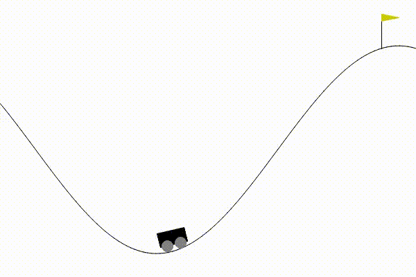

# PPO for MountainCarContinuous (from scratch)

This project implements **Proximal Policy Optimization (PPO)** from scratch in **PyTorch** to solve the **MountainCarContinuous-v0** control task.  
The goal is to demonstrate a full, correct implementation of a modern policy-gradient algorithm without relying on RL libraries such as Stable-Baselines.

---

## Problem Overview

**MountainCarContinuous-v0** is a continuous control environment where an underpowered car must build momentum to reach the goal at the top of a hill.

- **State space:** 2D (position, velocity)
- **Action space:** Continuous (engine force ∈ [-1, 1])
- **Reward:**
  - `+100` for reaching the goal
  - `-0.1 × action²` penalty per timestep

---

## Why PPO?

- DQN only supports **discrete actions**
- MountainCarContinuous requires **continuous control**
- PPO is:
  - stable
  - sample-efficient
  - well-suited for continuous action spaces

This project uses:
- **Actor–Critic architecture**
- **Clipped PPO objective**
- **Generalized advantage estimation (simplified)**
- **Entropy regularization for exploration**

---

## Implementation Details

### Model
- **Actor:** outputs mean of a Gaussian policy
- **Critic:** estimates state value `V(s)`
- **Action distribution:**  
  \[
  a \sim \mathcal{N}(\mu(s), \sigma)
  \]

---

## Results

After training, the agent consistently reaches the goal with stable performance:

- **Average episode return:** ~93–94
- **Behavior:** backward → forward momentum strategy
- **Stability:** low variance across episodes
